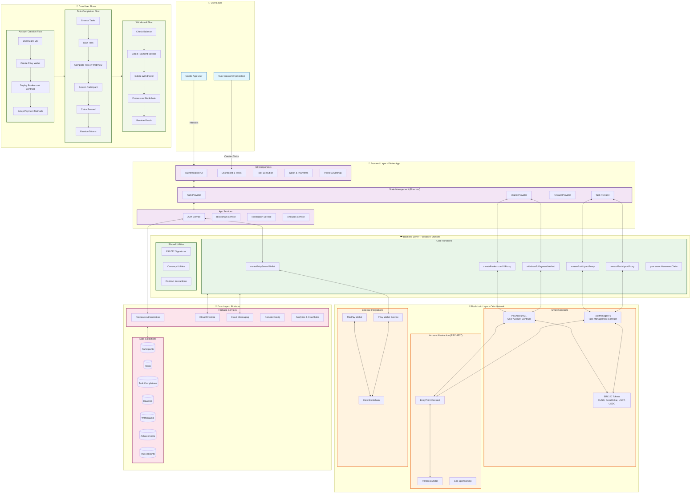

# Pax - Blockchain-Powered Canvassing & Task Platform

Pax is a comprehensive platform that enables organizations to create and manage micro-tasks while rewarding participants with cryptocurrency tokens. The platform combines a modern Flutter mobile application with blockchain technology, Firebase backend services, and smart contracts to create a secure, scalable, and user-friendly task management ecosystem.

## Project Overview

Pax consists of three main components:
1. **Mobile Application** (Flutter) - Cross-platform app with authentication, task management, and cryptocurrency integration
2. **Smart Contracts** (Solidity/Hardhat) - Upgradeable contracts for user accounts and task management on Celo blockchain
3. **Backend Services** (Firebase Functions) - Server-side logic for blockchain integration, notifications, and data management

## System Architecture

Pax implements a modern, layered architecture that combines traditional web2 infrastructure with cutting-edge blockchain technology:

### Frontend Layer (Flutter App)
- **Cross-platform mobile application** (iOS/Android) built with Flutter
- **Riverpod state management** for reactive UI and business logic
- **Firebase Authentication** with Google Sign-In integration
- **Celo blockchain integration** with MiniPay wallet support
- **Multi-currency support** (Good Dollar, Celo Dollar, USDT, USDC)
- **Real-time notifications** and task progress tracking

### Backend Layer (Firebase Functions)
- **Serverless cloud functions** for business logic and blockchain orchestration
- **Account abstraction** using ERC-4337 with Pimlico bundler
- **Privy-managed server wallets** for secure key management
- **EIP-712 signature verification** for secure transaction authorization
- **Smart contract deployment** and interaction automation

### Blockchain Layer (Celo Network)
- **PaxAccountV1**: Upgradeable smart contracts for user account management
- **TaskManagerV1**: Task lifecycle management with cryptographic verification
- **ERC-20 token integration** for multi-currency reward distribution
- **Proxy pattern** for contract upgradeability and gas optimization

### Data Layer (Firebase)
- **Cloud Firestore** for real-time data synchronization
- **Firebase Cloud Messaging** for push notifications
- **Firebase Remote Config** for feature flags and A/B testing
- **Comprehensive analytics** with Firebase Analytics and Crashlytics

## Technology Stack

### Frontend (Flutter App)
- **Flutter 3.x** - Cross-platform mobile development framework
- **Riverpod 3.0** - Reactive state management with code generation
- **Firebase SDK** - Authentication, Firestore, Analytics, Remote Config
- **GoRouter** - Declarative routing with authentication guards
- **ShadCN Flutter** - Design system and UI component library
- **Branch.io** - Deep linking and attribution
- **Viem & Web3** - Blockchain interaction and wallet integration

### Backend (Firebase Functions)
- **Node.js & TypeScript** - Server-side runtime and type safety
- **Firebase Functions** - Serverless cloud function platform
- **Privy SDK** - Secure wallet infrastructure and key management
- **Viem** - Ethereum client for contract interactions
- **Pimlico** - Account abstraction bundler service
- **EIP-712** - Typed structured data signing standard

### Blockchain (Celo Network)
- **Solidity 0.8.28** - Smart contract programming language
- **OpenZeppelin Contracts** - Security-audited contract libraries
- **Hardhat** - Ethereum development environment
- **UUPS Proxy Pattern** - Upgradeable contract architecture
- **ERC-4337** - Account abstraction standard
- **Multi-token Support** - CUSD, Good Dollar, USDT, USDC

### Infrastructure & DevOps
- **Firebase Hosting** - Web app deployment
- **Cloud Firestore** - NoSQL real-time database
- **Firebase Cloud Messaging** - Push notification service
- **Firebase Analytics** - User behavior tracking
- **Celo Blockchain** - Carbon-negative, mobile-first blockchain

## Getting Started

### Prerequisites
- **Flutter SDK** (3.0 or later)
- **Node.js** (v18 or later) and npm
- **Firebase CLI** for cloud functions deployment
- **Android Studio/Xcode** for mobile development
- **Git** for version control

### Installation

1. **Clone the repository:**
```bash
git clone https://github.com/your-org/pax.git
cd pax
```

2. **Install Flutter dependencies:**
```bash
cd flutter
flutter pub get
```

3. **Install Firebase Functions dependencies:**
```bash
cd functions
npm install
```

4. **Install Hardhat dependencies:**
```bash
cd ../hardhat
npm install
```

### Configuration

1. **Firebase Setup:**
   - Create a new Firebase project at https://console.firebase.google.com
   - Enable Authentication, Firestore, Functions, and Cloud Messaging
   - Download configuration files for Android and iOS
   - Place configuration files in appropriate Flutter directories

2. **Environment Variables:**
   - Copy `.env.example` to `.env` in the functions directory
   - Configure Privy API keys, Celo RPC endpoints, and contract addresses
   - Set up Pimlico bundler credentials for account abstraction

3. **Blockchain Configuration:**
   - Configure Celo network settings in `hardhat.config.ts`
   - Set up deployment wallet private keys (use hardware wallet for mainnet)
   - Update contract addresses in shared configuration files

### Development

1. **Start the Flutter app:**
```bash
cd flutter
flutter run
```

2. **Deploy Firebase Functions (optional for local development):**
```bash
cd functions
npm run deploy
```

3. **Deploy Smart Contracts:**
```bash
cd hardhat
npx hardhat run ignition/modules/TaskManagerV1.ts --network alfajores  # Testnet
npx hardhat run ignition/modules/TaskManagerV1.ts --network celo       # Mainnet
```

### Testing

1. **Run Flutter tests:**
```bash
cd flutter
flutter test
```

2. **Run smart contract tests:**
```bash
cd hardhat
npm test
```

## Key Features

### 🔐 Account Abstraction & Wallet Management
- **Gasless Transactions**: Users interact without managing gas fees
- **Smart Account Wallets**: ERC-4337 compatible accounts with advanced features
- **MiniPay Integration**: Seamless connection with Celo's native wallet
- **Multi-Currency Support**: Support for 4 major tokens (CUSD, Good Dollar, USDT, USDC)

### 📱 Mobile-First Experience
- **Cross-Platform**: Native iOS and Android apps built with Flutter
- **Offline Capability**: Works without constant internet connection
- **Real-time Sync**: Live updates using Firebase Firestore
- **Push Notifications**: Smart notification system for task updates

### 🎯 Task Management System
- **WebView Task Execution**: Embedded web-based task completion
- **Cryptographic Verification**: EIP-712 signatures for secure task validation
- **Automated Screening**: Server-side participant verification
- **Reward Distribution**: Automatic cryptocurrency payments upon completion

### 🏆 Achievement & Analytics System
- **Progress Tracking**: Comprehensive user journey analytics
- **Badge System**: Gamified achievements for user engagement
- **Performance Metrics**: Detailed task completion analytics
- **Real-time Dashboards**: Live statistics and progress monitoring

## Development Guidelines

### Mobile Application (Flutter)
- **Architecture**: Follow clean architecture principles with Riverpod
- **State Management**: Use providers for business logic separation
- **Testing**: Write widget tests and integration tests
- **Performance**: Optimize for 60fps animations and minimal memory usage
- **Security**: Implement secure storage for sensitive data

### Backend Services (Firebase Functions)
- **Type Safety**: Use TypeScript for all cloud functions
- **Error Handling**: Implement comprehensive error logging and user feedback
- **Scalability**: Design functions for high concurrency and auto-scaling
- **Security**: Validate all inputs and implement proper authentication
- **Monitoring**: Use Firebase Performance and Error Reporting

### Smart Contracts (Solidity)
- **Security First**: Follow OpenZeppelin patterns and best practices
- **Gas Optimization**: Minimize transaction costs through efficient code
- **Upgradeability**: Use UUPS proxy pattern for future improvements
- **Testing**: Achieve 100% test coverage with integration tests
- **Documentation**: Comprehensive NatSpec documentation for all functions

## Security Architecture

### 🛡️ Multi-Layer Security
- **Authentication**: Firebase Auth with Google Sign-In integration
- **Authorization**: Role-based access control with signature verification
- **Data Protection**: End-to-end encryption for sensitive operations
- **Audit Trail**: Comprehensive logging of all blockchain transactions

### 🔒 Smart Contract Security
- **Formal Verification**: Mathematical proofs of contract correctness
- **Access Controls**: Owner-only functions with multi-signature support
- **Emergency Mechanisms**: Pausable contracts for emergency situations
- **Upgrade Safety**: Time-locked upgrades with community governance

### 🔐 Key Management
- **Server-Managed Wallets**: Privy-managed wallets with secure server infrastructure
- **API-Based Security**: Private keys accessed through authenticated API calls
- **Key Rotation**: Regular rotation of signing keys and API credentials
- **Secure Infrastructure**: Protected key storage using cloud security best practices
- **Recovery Mechanisms**: Server-side backup and recovery systems

## Contributing

1. Fork the repository
2. Create your feature branch
3. Write tests for new functionality
4. Ensure all tests pass
5. Submit a pull request

## License

This project is proprietary and confidential. All rights reserved.

## Support

For support, please contact the development team or raise an issue in the repository.


