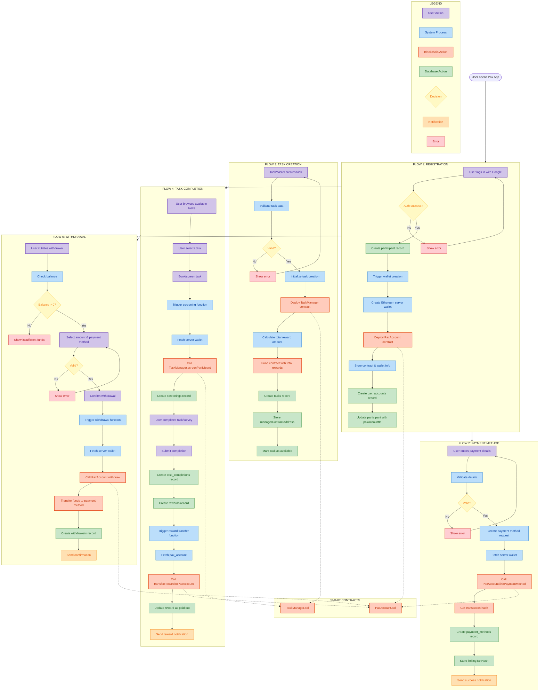

# Pax - Decentralized Task Management Platform

Pax is a comprehensive platform that combines mobile application development with blockchain technology to create a secure and efficient task management system. The platform enables organizations to create tasks, screen participants, and distribute rewards through a decentralized infrastructure.

## Project Overview

Pax consists of two main components:
1. **Mobile Application** (Flutter)
2. **Smart Contracts** (Solidity/Hardhat)

## System Architecture

The following diagram illustrates the complete flow of the Pax platform:



## Key Features

### Mobile Application
- Task management and completion tracking
- Participant screening and verification
- Reward distribution and tracking
- Payment method management
- Real-time notifications
- Activity feed and history

### Smart Contracts
- Secure participant account management
- Task creation and management
- Automated reward distribution
- Payment method integration
- Withdrawal processing

## Technology Stack

### Mobile Application
- Flutter for cross-platform development
- Firebase for backend services
- Riverpod for state management
- Firebase Cloud Messaging for notifications

### Smart Contracts
- Solidity for contract development
- Hardhat for development environment
- OpenZeppelin for security standards
- Ethers.js for blockchain interaction

## Getting Started

### Prerequisites
- Flutter SDK
- Node.js (v16 or later)
- Firebase project
- Ethereum development environment

### Installation

1. Clone the repository:
```bash
git clone https://github.com/your-org/pax.git
cd pax
```

2. Install dependencies:
```bash
# Install Flutter dependencies
cd flutter
flutter pub get

# Install Hardhat dependencies
cd ../hardhat
npm install
```

3. Configure environment:
- Set up Firebase project and add configuration files
- Configure Ethereum network settings
- Set up environment variables

4. Run the application:
```bash
# Start the Flutter app
cd flutter
flutter run

# Deploy smart contracts
cd ../hardhat
npx hardhat run scripts/deploy.js --network <network>
```

## Development

### Mobile Application
- Follow Flutter best practices
- Use Riverpod for state management
- Implement proper error handling
- Write unit and widget tests

### Smart Contracts
- Follow Solidity best practices
- Implement comprehensive testing
- Use gas optimization techniques
- Maintain security standards

## Security

- Regular security audits
- Smart contract best practices
- Secure key management
- Access control implementation
- Emergency pause functionality

## Contributing

1. Fork the repository
2. Create your feature branch
3. Write tests for new functionality
4. Ensure all tests pass
5. Submit a pull request

## License

This project is proprietary and confidential. All rights reserved.

## Support

For support, please contact the development team or raise an issue in the repository.
