# Pax - Online Micro Tasks Platform

Pax is a comprehensive platform that enables organizations to create and manage micro-tasks while rewarding participants with both stable and non-stable tokens. The platform combines mobile application development with blockchain technology to create a secure and efficient task management system.

## Project Overview

Pax consists of two main components:
1. **Mobile Application** (Flutter)
2. **Smart Contracts** (Solidity/Hardhat)

## System Architecture

The system is built with a modular architecture that separates concerns across different layers:

### Mobile Application
- User interface and interaction
- Task completion tracking
- Payment method management
- Achievement tracking
- Claim processing

### Services Layer
- Authentication and user management
- Task verification and tracking
- Payment processing
- Achievement system
- Claim management

### Blockchain Layer
- Smart contract for task verification
- Wallet integration
- Payment processing
- Achievement verification
- Claim verification

### Database Layer
- User data storage
- Task completion records
- Payment transaction history
- Achievement tracking
- Claim management

## Technology Stack

### Mobile Application
- Flutter for cross-platform development
- Firebase for authentication
- Web3 for blockchain integration
- Secure storage for sensitive data

### Smart Contract
- Solidity for contract development
- OpenZeppelin for security standards
- Task completion verification
- Payment processing
- Achievement tracking
- Claim management

## Getting Started

### Prerequisites
- Flutter SDK
- Node.js (v16 or later)
- Firebase project
- Ethereum development environment

### Installation

1. Clone the repository:
```bash
git clone https://github.com/your-org/pax.git
cd pax
```

2. Install dependencies:
```bash
# Install Flutter dependencies
cd flutter
flutter pub get

# Install Hardhat dependencies
cd ../hardhat
npm install
```

3. Configure environment:
- Set up Firebase project and add configuration files
- Configure Ethereum network settings
- Set up environment variables

4. Run the application:
```bash
# Start the Flutter app
cd flutter
flutter run

# Deploy smart contracts
cd ../hardhat
npx hardhat run scripts/deploy.js --network <network>
```

## Development

### Mobile Application
- Follow Flutter best practices
- Use Riverpod for state management
- Implement proper error handling
- Write unit and widget tests

### Smart Contracts
- Follow Solidity best practices
- Implement comprehensive testing
- Use gas optimization techniques
- Maintain security standards

## Security

- Regular security audits
- Smart contract best practices
- Secure key management
- Access control implementation
- Emergency pause functionality

## Contributing

1. Fork the repository
2. Create your feature branch
3. Write tests for new functionality
4. Ensure all tests pass
5. Submit a pull request

## License

This project is proprietary and confidential. All rights reserved.

## Support

For support, please contact the development team or raise an issue in the repository.

```mermaid
graph TD
    %% Define components
    subgraph MobileApp[📱 Mobile App]
        UI[User Interface]
        Auth[Authentication]
        Task[Task Management]
        Payment[Payment Processing]
        Achievement[Achievement System]
        Claim[Claim Management]
    end

    subgraph Services[🔄 Services]
        AuthService[Authentication Service]
        TaskService[Task Service]
        PaymentService[Payment Service]
        AchievementService[Achievement Service]
        ClaimService[Claim Service]
    end

    subgraph Blockchain[⛓️ Blockchain Layer]
        SmartContract[Smart Contract]
        Wallet[Wallet Integration]
    end

    subgraph Database[💾 Database Layer]
        UserDB[(User Data)]
        TaskDB[(Task Data)]
        PaymentDB[(Payment Data)]
        AchievementDB[(Achievement Data)]
        ClaimDB[(Claim Data)]
    end

    %% Define flows
    subgraph Flows[🔄 Core Flows]
        F1[Account Creation Flow]
        F2[Payment Method Flow]
        F3[Task Completion Flow]
        F4[Withdrawal Flow]
        F5[Achievement Flow]
        F6[Claim Flow]
    end

    %% Define relationships
    classDef userAction fill:#f9f,stroke:#333,stroke-width:2px
    classDef systemProcess fill:#bbf,stroke:#333,stroke-width:2px
    classDef blockchainAction fill:#bfb,stroke:#333,stroke-width:2px
    classDef databaseAction fill:#fbb,stroke:#333,stroke-width:2px
    classDef other fill:#ddd,stroke:#333,stroke-width:2px

    %% User Actions
    UI -->|Sign In| Auth
    UI -->|Complete Task| Task
    UI -->|Connect Payment| Payment
    UI -->|View Achievements| Achievement
    UI -->|Claim Reward| Claim

    %% Service Connections
    Auth -->|Verify| AuthService
    Task -->|Update| TaskService
    Payment -->|Process| PaymentService
    Achievement -->|Track| AchievementService
    Claim -->|Manage| ClaimService

    %% Blockchain Interactions
    PaymentService -->|Verify| SmartContract
    TaskService -->|Verify| SmartContract
    AchievementService -->|Verify| SmartContract
    ClaimService -->|Verify| SmartContract
    SmartContract -->|Connect| Wallet

    %% Database Operations
    AuthService -->|Store| UserDB
    TaskService -->|Update| TaskDB
    PaymentService -->|Record| PaymentDB
    AchievementService -->|Track| AchievementDB
    ClaimService -->|Manage| ClaimDB

    %% Flow Connections
    F1 -->|Initialize| AuthService
    F2 -->|Setup| PaymentService
    F3 -->|Process| TaskService
    F4 -->|Execute| PaymentService
    F5 -->|Track| AchievementService
    F6 -->|Process| ClaimService

    %% Apply styles
    class UI,Auth,Task,Payment,Achievement,Claim userAction
    class AuthService,TaskService,PaymentService,AchievementService,ClaimService systemProcess
    class SmartContract,Wallet blockchainAction
    class UserDB,TaskDB,PaymentDB,AchievementDB,ClaimDB databaseAction
    class Flows other
```


