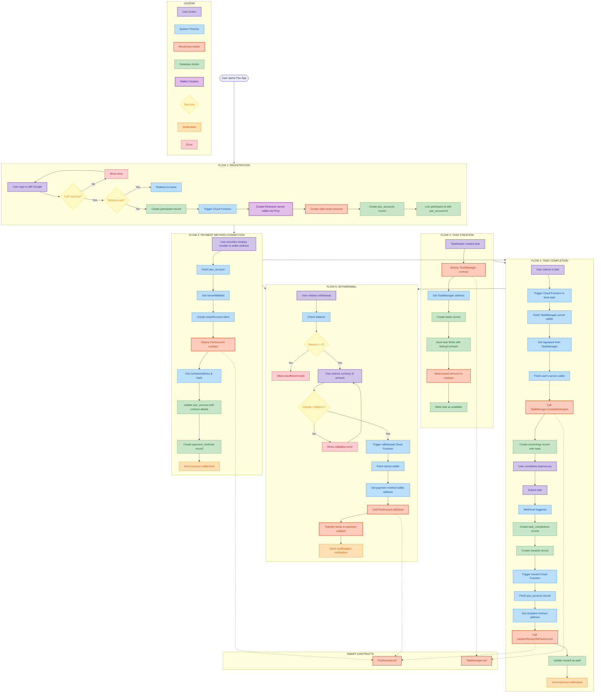

# Pax

...

## System Architecture

The following diagram illustrates the complete flow of the Pax mobile app:

```mermaid
flowchart TD
    %% Style definitions
    classDef userAction fill:#d1c4e9,stroke:#7e57c2,stroke-width:2px,color:#4527a0
    classDef systemProcess fill:#bbdefb,stroke:#1976d2,stroke-width:1px,color:#0d47a1
    classDef blockchainAction fill:#ffccbc,stroke:#e64a19,stroke-width:2px,color:#bf360c
    classDef databaseAction fill:#c8e6c9,stroke:#388e3c,stroke-width:1px,color:#1b5e20
    classDef decision fill:#fff9c4,stroke:#fbc02d,stroke-width:1px,color:#f57f17
    classDef notification fill:#ffe0b2,stroke:#f57c00,stroke-width:1px,color:#e65100
    classDef error fill:#ffcdd2,stroke:#d32f2f,stroke-width:1px,color:#b71c1c
    classDef wallet fill:#e1bee7,stroke:#8e24aa,stroke-width:2px,color:#4a148c
    
    %% Main entry point
    START([User opens Pax App]) --> F1

    %% FLOW 1: Registration & Onboarding
    subgraph F1[FLOW 1: REGISTRATION]
        A1[User logs in with Google]:::userAction --> A2{Auth success?}:::decision
        A2 -->|No| A3[Show error]:::error --> A1
        A2 -->|Yes| A4{Existing user?}:::decision
        A4 -->|Yes| A5[Redirect to home]:::systemProcess
        A4 -->|No| A6[Create participant record]:::databaseAction
        A6 --> A7[Trigger Cloud Function]:::systemProcess
        A7 --> A8[Create Ethereum server wallet via Privy]:::wallet
        A8 --> A9[Create Safe smart account]:::blockchainAction
        A9 --> A10[Create pax_accounts record]:::databaseAction
        A10 --> A11[Link participant.id with pax_account.id]:::databaseAction
    end

    %% FLOW 2: Payment Method Connection
    subgraph F2[FLOW 2: PAYMENT METHOD CONNECTION]
        B1[User provides minipay number & wallet address]:::userAction --> B2[Fetch pax_account]:::systemProcess
        B2 --> B3[Get serverWalletId]:::systemProcess
        B3 --> B4[Create smartAccount client]:::systemProcess
        B4 --> B5[Deploy PaxAccount contract]:::blockchainAction
        B5 --> B6[Get contractAddress & hash]:::systemProcess
        B6 --> B7[Update pax_account with contract details]:::databaseAction
        B7 --> B8[Create payment_methods record]:::databaseAction
        B8 --> B9[Send success notification]:::notification
    end

    %% FLOW 3: TaskMaster Creating a Task
    subgraph F3[FLOW 3: TASK CREATION]
        C1[TaskMaster creates task]:::userAction --> C2[Deploy TaskManager contract]:::blockchainAction
        C2 --> C3[Get TaskManager address]:::systemProcess
        C3 --> C4[Create tasks record]:::databaseAction
        C4 --> C5[Save task fields with linkingTxnHash]:::databaseAction
        C5 --> C6[Send reward amount to contract]:::blockchainAction
        C6 --> C7[Mark task as available]:::databaseAction
    end

    %% FLOW 4: Participant Completes a Task
    subgraph F4[FLOW 4: TASK COMPLETION]
        D1[User selects a task]:::userAction
        D1 --> D2[Trigger Cloud Function to book task]:::systemProcess
        D2 --> D3[Fetch TaskManager server wallet]:::systemProcess
        D3 --> D4[Get signature from TaskManager]:::systemProcess
        D4 --> D5[Fetch user's server wallet]:::systemProcess
        D5 --> D6[Call TaskManager.screenParticipant]:::blockchainAction
        D6 --> D7[Create screenings record with hash]:::databaseAction
        D7 --> D8[User completes task/survey]:::userAction
        D8 --> D9[Submit task]:::userAction
        D9 --> D10[Webhook triggered]:::systemProcess
        D10 --> D11[Create task_completions record]:::databaseAction
        D11 --> D12[Create rewards record]:::databaseAction
        D12 --> D13[Trigger reward Cloud Function]:::systemProcess
        D13 --> D14[Fetch pax_account record]:::systemProcess
        D14 --> D15[Get recipient contract address]:::systemProcess
        D15 --> D16[Call transferRewardToPaxAccount]:::blockchainAction
        D16 --> D17[Update reward as paid]:::databaseAction
        D17 --> D18[Send success notification]:::notification
    end

    %% FLOW 5: Participant Makes a Withdrawal
    subgraph F5[FLOW 5: WITHDRAWAL]
        E1[User initiates withdrawal]:::userAction --> E2[Check balance]:::systemProcess
        E2 --> E3{Balance > 0?}:::decision
        E3 -->|No| E4[Show insufficient funds]:::error
        E3 -->|Yes| E5[User selects currency & amount]:::userAction
        E5 --> E6{Amount ≤ Balance?}:::decision
        E6 -->|No| E7[Show validation error]:::error --> E5
        E6 -->|Yes| E8[Trigger withdrawal Cloud Function]:::systemProcess
        E8 --> E9[Fetch server wallet]:::systemProcess
        E9 --> E10[Get payment method wallet address]:::systemProcess
        E10 --> E11[Call PaxAccount.withdraw]:::blockchainAction
        E11 --> E12[Transfer funds to payment method]:::blockchainAction
        E12 --> E13[Send confirmation notification]:::notification
    end

    %% Smart Contracts (placed on the side)
    subgraph SC[SMART CONTRACTS]
        direction LR
        SC1[PaxAccount.sol]:::blockchainAction
        SC2[TaskManager.sol]:::blockchainAction
    end

    %% Flow connections
    F1 --> F2
    F2 --> F4
    F2 --> F5
    F3 --> F4
    F4 --> F5

    %% Contract connections
    B5 -.-> SC1
    C2 -.-> SC2
    D6 -.-> SC2
    D16 -.-> SC1
    E11 -.-> SC1

    %% Legend
    subgraph LEGEND[LEGEND]
        direction LR
        LEGEND_USER[User Action]:::userAction
        LEGEND_SYSTEM[System Process]:::systemProcess
        LEGEND_BLOCKCHAIN[Blockchain Action]:::blockchainAction
        LEGEND_DATABASE[Database Action]:::databaseAction
        LEGEND_WALLET[Wallet Creation]:::wallet
        LEGEND_DECISION{Decision}:::decision
        LEGEND_NOTIFICATION[Notification]:::notification
        LEGEND_ERROR[Error]:::error
    end
```
